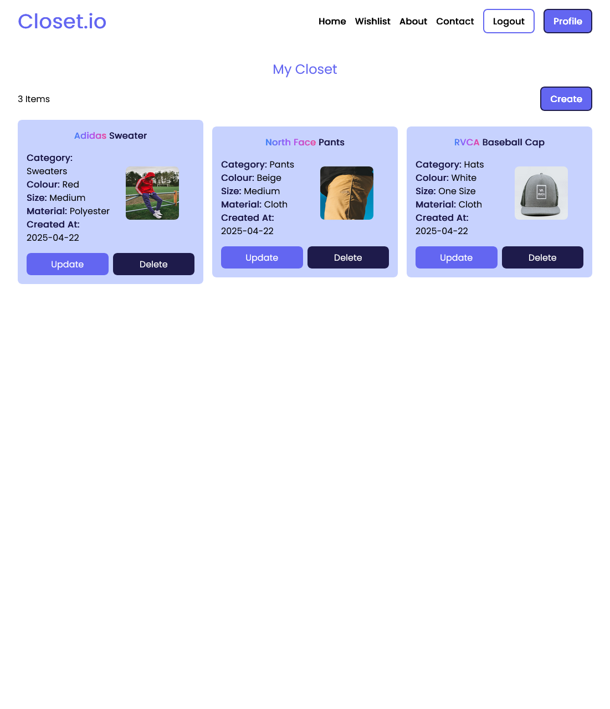

## 🎯 Project Overview

This application enables users to register, log in, and manage items in their digital closet. Items can be categorized, updated, and deleted with a clean and responsive interface. Built for usability and efficiency, it leverages PostgreSQL for structured data storage and React for a modern frontend experience.

## 💡 Key Features

- 🧥 Add, edit, and delete clothing items
- 📂 Organize wardrobe by categories, colors, seasons, or tags
- 🔐 Secure user authentication using JWT and bcrypt
- 🧭 Smooth navigation with React Router
- ⚡ Lightweight state management using Zustand
- 📦 RESTful API built with Express & Sequelize
- 🧑‍💻 Persistent storage with PostgreSQL on NeonDB
- 📱 Fully responsive layout for desktop and mobile
- 🛡️ Protected routes and user-specific closets
- 🧹 Clean, modular codebase for scalability

## 🛠️ Technologies Used

### Frontend

- **React 18** — UI Library
- **React Router** — Client-side routing
- **Zustand** — Global state management
- **HTML & CSS** — Markup and custom styling
- **JavaScript (ES6+)** — Application logic
- **Axios** — HTTP client for API requests

### Backend

- **Node.js + Express** — REST API server
- **PostgreSQL + Sequelize** — Relational database and ORM
- **Neon** — Serverless PostgreSQL hosting
- **JWT + bcrypt** — Authentication and password hashing

## 📸 Screenshots

